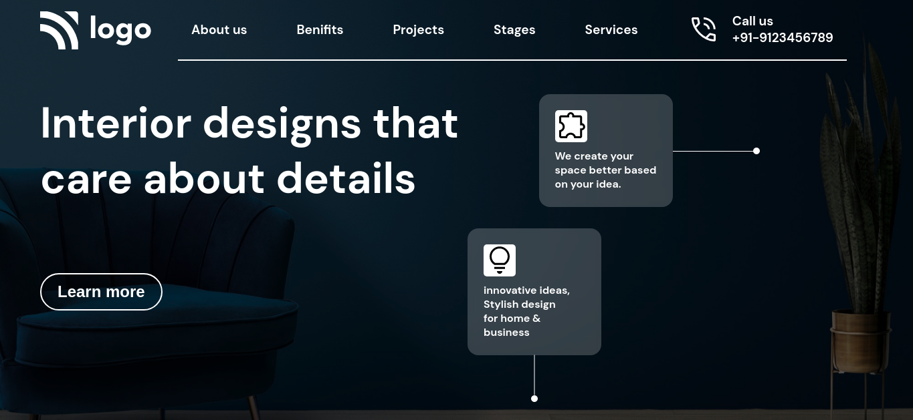

# This is a landing page for interior design company

Made by **Aditya Kadali**

## Screenshots:

## Built with:

- Semantic HTML
- CSS
- Flexbox
- Grid System

## Key Learnings:

- Using divs as design elements
- Learned to create background blur effect

## Time taken:

- This landing page took me 4.5 hours to build from scratch.

## Links:

- [Live demo](https://interior-design-page.netlify.app/)
- [Source code](https://github.com/Adityakadali/Interior-Design-landing-page)
